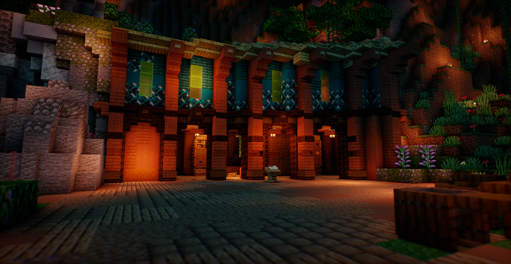

# 💰 Склад новичков

## Как работает склад

#### Это здание создано для того, что-бы вы могли заработать себе начальные АРы. Как это работает?! В бочках лежат АРы. Белые рамке расположен блок, который Государство скупает у вас. Вы, если у вас есть блоки (от стака) кладёте их в нужную бочку и забираете АРы в зависимости от того, сколько стоит стак того или иного блока! И вы заработаете и государству Magma поможете. На третьем этаже этого здания будут лежать ресурсы на строительство проектов. Так-что если вы хотите что-то принести от себя, то вы можете это сделать зайдя на второй этаж и положить блоки в сундуки. Мы в свою очередь скажем вам "спасибо". Координаты: -221 64 -118

<figure><figcaption></figcaption></figure>

