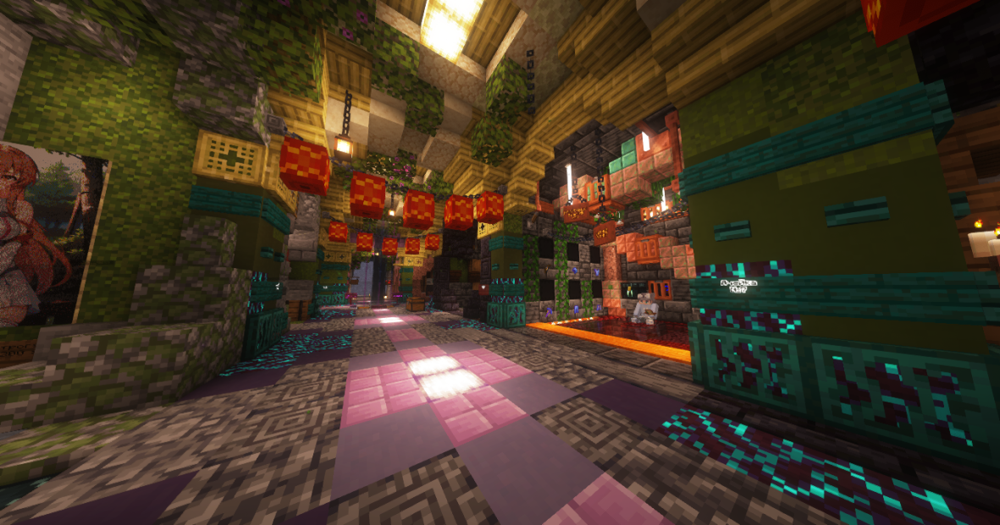

# 🛒 Торговая Зона

## Как покупать

#### Для того чтобы купить что-либо в торговой зоне(тз) вы должны прийти на координаты -235 70 -78, выбрать магазин в котором хотите совершить покупку, а так же нужный товар, затем взять этот товар, положив вместо него АРы в том количестве, в котором нужно по правилам магазина.

## Как продавать

#### Для начала вам нужно купить место под торговлю. Цены меняются, но пока что есть всего 3 вида ячеек. Ячейка для магазина на 1 и 2 этаже (на 1 стоит дороже) и бочка в государственных ячейках. Оплата идёт еженедельная. Торговая зона это единственное место где разрешена афк торговля.

<figure><figcaption></figcaption></figure>
