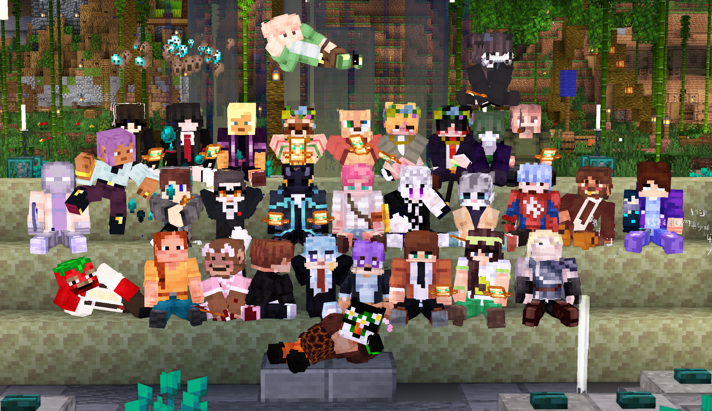

---
layout:
  title:
    visible: true
  description:
    visible: false
  tableOfContents:
    visible: true
  outline:
    visible: true
  pagination:
    visible: true
---

# 💼 Необходимые моды

<figure><figcaption>
10.02.24
</figcaption></figure>

### Для того, чтобы с комфортом играть на нашем проекте - вам необходимо установить в свой Minecraft необходимые моды

**К счастью для вас,** мы подобрали оптимизирующую сборку, для игры на нашем проекте. В этом мод-паке собраны все необходимые моды и конфигурации

**Ссылка на нашу сборку:** [https://modrinth.com/mod/magmamods](https://modrinth.com/mod/magmamods)

## Список необходимых модов

**Если вы хотите** самостоятельно установить моды, не пользуясь нашим мод-паком. То для вас мы подготовили полный список модов и для чего они нужны!

**Важно!** Подбирая самостоятельно сборку для игры на сервере, важно отметить, что лучше использовать **Fabric**, нежели **Forge**. Т.к во втором случае у вас врят-ли некоторые моды будут работать на сервере. Один из этих модов - **PlasmoVoice**

## PlasmoVoice

**Это мод** на голосовой чат в игре. Очень желателен к установке даже тем, у кого нет микрофона. Позволяет также использовать кастомные пластинки&#x20;

**Ссылка для скачивания:** [https://modrinth.com/plugin/plasmo-voice/versions?l=fabric](https://modrinth.com/plugin/plasmo-voice/versions?l=fabric)&#x20;

## EmoteCraft

**Данный мод** позволяет использовать эмоции на сервере. Рекомендуется к установке&#x20;

**Ссылка для скачивания:** [https://modrinth.com/mod/emotecraft/versions?l=fabric](https://modrinth.com/mod/emotecraft/versions?l=fabric)&#x20;

### CITResewn

**Этот мод -** замена оптифайну, позволяет оторбажать некоторые текстурки нашего текстурпака. Очень рекомендуется к скачиванию для тех кто без оптифайна&#x20;

**Ссылка для скачивания:** [https://modrinth.com/mod/cit-resewn/versions](https://modrinth.com/mod/cit-resewn/versions)

## EntityModelFeatures

**Дополнение к CITResewn**, позволяющий отображать некоторые текстуры в серверном ресурспаке. Не может работать без мода ниже

**Ссылка для скачивания:** [**https://modrinth.com/mod/entity-model-features**](https://modrinth.com/mod/entity-model-features)

## EntityTextureFeatures

**Дополнение к CITResewn**, позволяющий отображать некоторые текстуры в серверном ресурспаке. Не может работать без мода выше

**Ссылка для скачивания:** [**https://modrinth.com/mod/entitytexturefeatures**](https://modrinth.com/mod/entitytexturefeatures)

### BobbyMod

**Очень полезная** модификация, чтобы визуально увеличить прогрузку на сервере. Т.к на сервере максимум можно увидеть 5 чанков, мод Bobby увеличивает это число путем сохранения чанков на вашем ПК. Очень рекомендуется для скачивания&#x20;

**Ссылка для скачивания:** [https://modrinth.com/mod/bobby/versions](https://modrinth.com/mod/bobby/versions)

## Ears

**Мод, позволяющий** отображать дополнения к скину, такие как: хвост, уши, крылья и т.п. Рекомендуется к установке

**Ссылка для скачивания:** [https://modrinth.com/mod/ears/versions](https://modrinth.com/mod/ears/versions)

### CinemaMod

**Эта модификация** не нагружает ПК, но добавляет возможность смотреть кинотеатр у нас на сервере. Скачивание не обязательна и работает только на 1.20.1&#x20;

**Ссылка для скачивания:**  [https://github.com/CinemaMod/CinemaMod/releases/tag/1.0.6-1.20.1](https://github.com/CinemaMod/CinemaMod/releases/tag/1.0.6-1.20.1) (Для Windows - windows amd версия | Для линкус - linux amd версия)
