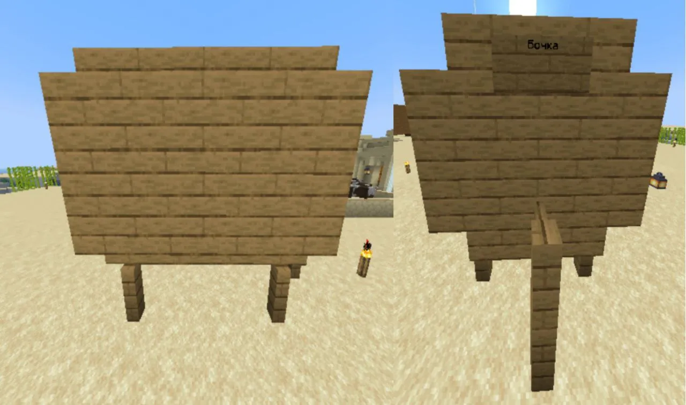

# 🍻 Как сделать алкогольный напиток

## Как же варить напитки?

#### Варка состоит всего из трех этапов: ферментация, дистилляция, настаивание. Не для всех напитков требуются все три этапа, это будет прописано в рецепте. Подробно о каждом из них:

## Ферментация

#### Для ферментации напитка вам понадобится котел, наполненный водой, под которым расположен открытый огонь (чтобы он не гас, можно зажечь его на незераке). Так же подойдут блок магмы, блок лавы и костер. Котлы можно ставить вплотную друг к другу, главное чтобы под каждым был источник тепла, указанный выше. После того как котел будет готов, нужно взять в руку ингредиенты, указанные в рецепте и нажать по котлу ПКМ. В каждом рецепте так же будет указано время ферментации. Чтобы его отслеживать можно взять простые часы и кликнуть ими ПКМ по котлу, в чате появится сообщение о том, сколько времени прошло с момента загрузки последнего ингредиента (в минутах). Время начинает отображаться только с третьей минуты, в течение первых двух вы будете получать сообщение «Котел только начал кипеть». Когда пройдет указанное в рецепте время, нужно взять в руки пустую бутылочку и кликнуть ПКМ по котлу, так содержимое из котла переместится в нее. Всего за один раз из полного котла можно собрать 3 бутылки напитка.

<figure><figcaption></figcaption></figure>

## Дистилляция

#### Некоторые напитки требуют дистилляции. Для этого вам понадобится простая зельеварка. В слот для ингредиента нужно положить одну светокаменную пыль (обновлять ее после каждой дистилляции не нужно, она действует вечно). После нужно загрузить бутылки с напитком в зельеварку и ждать, пока они не пройдут указанное в рецепте количество циклов дистилляции. Дистилляция остановится автоматически когда будет достигнуто максимальное (нужное) количество циклов, так что внимательно следить за этим этапом, как за другими двумя, не обязательно. Если в зельеварку со светопылью засунуть не предназначенный для дистилляции напиток, то он с каждым циклом будет терять свое качество и превратится в мутный дистиллят.

<figure><figcaption></figcaption></figure>

## Выдержка

#### Последний этап приготовления напитка – выдержка. Для него необходимо построить бочку. 1 год выдержки равен 20и минутам реального времени. Бочки делятся по типу древесины, из которой они сделаны (в рецептах указывается, в какой бочке необходимо выдерживать каждый напиток) и по размеру:

### **Малая бочка**

#### Чтобы построить малую бочку необходимо 8 ступеней и табличка, на которой нужно написать "Бочка". Содержит 9 слотов под напитки.

<figure><figcaption></figcaption></figure>

### Большая бочка

#### Чтобы сделать большую бочку, вам потребуется 16 деревянных лестниц, 6 деревянных заборов и 18 досок(всё любого вида, но бочка должна быть сделана из одного вида дерева) В ней помещается 27 напитков. Для открытия бочки поставьте табличку с текстом "Бочка" как показано на скриншоте.

<figure><figcaption></figcaption></figure>

## Примечание

#### Пейте пиво в меру! Вас будет шатать из стороны в сторону если вы много выпьете, и вы не сможете нормально писать в чат

#### Если название вашего напитка изменилось, то значит вы сделали его хорошим или плохим. Чтобы узнать как вы его сделали: хорошо или плохо, вам надо посмотреть на звезды в описании объекта. 5 звезд - отличное, 4 - хуже, но все еще ' нормально ит.д

#### И помните: пить в игре можно сколько угодно, но в жизни это. плохо для вашего здоровья!
