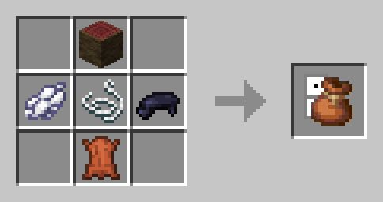

# 🎹 Мешочек с домино

#### **Содержит 24 домино.** Если связка находится в левой руке, а домино в основной руке, то при использовании домино поместится в связку. **Выпавший сверток через 2 секунды** соберет все доминошки (или пока не закончится место) со стола на расстоянии 1 блока. **Взаимодействуя с домино в положении приседа**, оно будет вращаться на 90°. При использовании в положении сидя он помещается как предмет.

<figure><figcaption></figcaption></figure>
