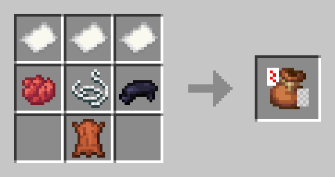

# 🃏 Мешочек с картами

#### **Содержит 54 карты.** При использовании выпадает случайная карта. Если сумка находится во второй руке, а карта в основной, то при использовании карта поместится в сумку. **Выпавшая связка через** 2 секунды соберет все карты (или пока не закончится место) со стола на расстоянии 1 блока. **При использовании, когда** вы приседаете и смотрите на блок, он помещается как предмет. Если посмотреть в воздух, то выдаст скрытую карту.

<figure><figcaption></figcaption></figure>
