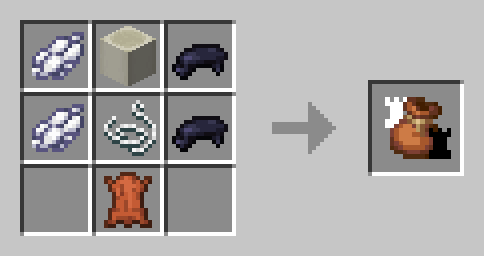

# ♟️ Мешочек с шахматами

#### **Содержит 32 шахматные фигуры**. Если связка находится в левой руке, а шахматная фигура в основной руке, то при использовании шахматная фигура поместится в связку. **Выпавший сверток через 2 секунды** соберет все шахматные фигуры (или пока не закончится место) со стола на расстоянии 1 блока. **Шахматные фигуры расставлены на сетке.** Сетка соответствует ячейкам на шахматной доске. При использовании в положении сидя он помещается как предмет.

<figure><figcaption></figcaption></figure>

