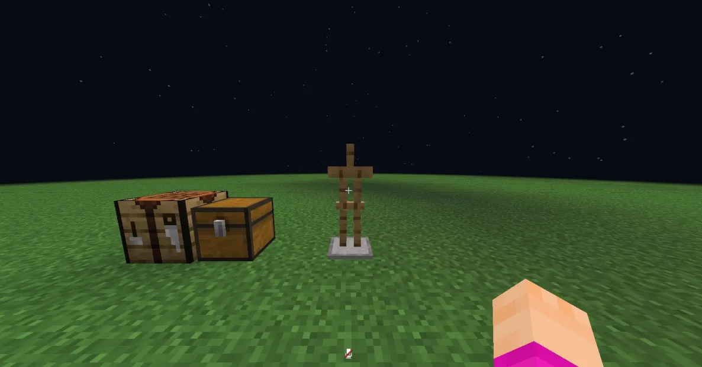
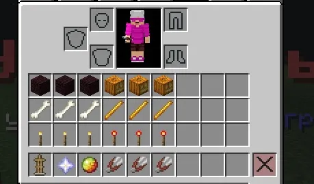
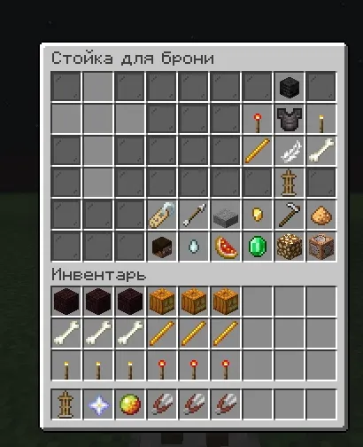
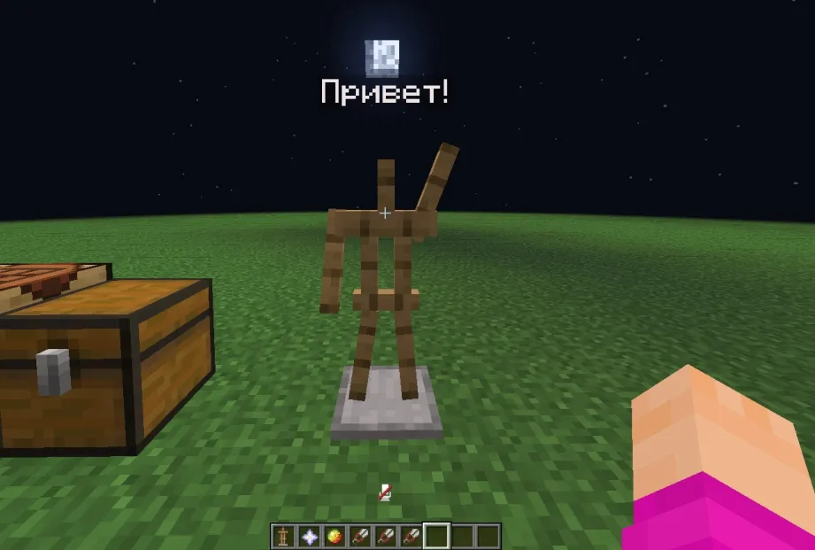

# 🧥 Стойка для брони

#### Для начала, чтобы начать редактировать стойку для брони, вам необходимо её скрафтить,а потом поставить на то место, где вы хотите её начать редактировать.

<figure><figcaption></figcaption></figure>

## Команды и редактирование стойки

#### После того как вы поставили стойку, пропишите команду /ast Все ваши ресурсы из инвентаря заменятся предметами редактирования, но не бойтесь, они вернуться сразу после окончания редактирования стойки :)

<figure><figcaption></figcaption></figure>

## Панель редактирования&#x20;

#### Для открытия панели редактирования стойки, вам нужно нажать на стойку Звездой незера, которая находится у вас в хотбаре. У вас должна открыться панель редактирования, здесь есть основные настройки. Так, например вы можете нажать сверху в правом углу на Череп визер-скелета, и движениями камеры, вы сможете редактировать положение головы у стойки. Также работает с остальными частями тела:&#x20;

#### Редстоун факел - Правая рука&#x20;

#### Незеритовый нагрудник - Тело&#x20;

#### Факел - Левая рука

#### &#x20;Стержень ифрита - Правая нога

#### &#x20;Кость - Левая нога&#x20;

#### Также среди этого там находится Перо. Оно отвечает за смещение самой стойки более детально, вы можете вплоть до сантиметра отредактировать местоположение вашей стойки.

<figure><figcaption></figcaption></figure>

## Настройки стойки&#x20;

#### Стойку можно настроить довольно детально, так, например вы можете добавить текст над головой стойки. Для того чтобы это сделать, вам нужно нажать на Бирку в панели. После этого, вам нужно будет написать в чат сообщение с тем. что вы хотите видеть над головой у стойки. Также вы можете добавить вашей стойке руки, для это вам нужно кликнуть на стрелу которая также находится в панели. Только после добавления рук, вы сможете редактировать их положение.

<figure><figcaption></figcaption></figure>

## Внешний вид стойки

#### Также, вы можете одеть стойку в покрашенную кожанную броню или в любую другую, которая вам нужна. Для этого вам нужно во всё той же панели найдите в левом верхнем углу слоты под броню броню, голову и предметы в руках.

<figure><figcaption></figcaption></figure>

## Готово!

#### Наконец-то! Ваша стойка для брони готова. После того как вы создали стойку которая вам нужна была, чтобы вернуть ваши ресурсы в инвентарь и выйти из режима редактирования, вам нужно повторно прописать команду /ast Приятной игры!

<figure><figcaption></figcaption></figure>
